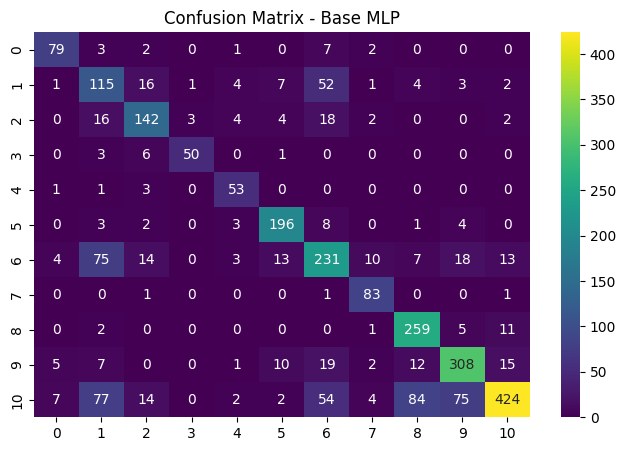
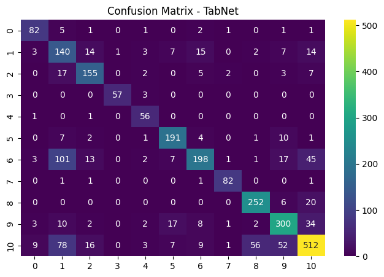
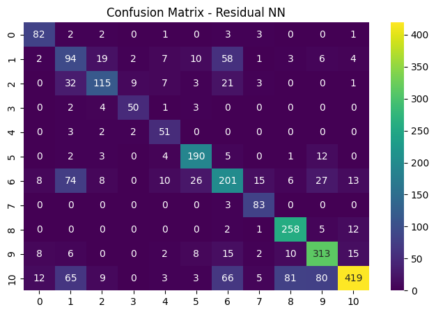

<div align="center">
🎵 CLASSIFICATION OF MUSIC GENRES BASED ON AUDIO CHARACTERISTICS

</div> <br>
📑 Table of Contents

1. Deskripsi Proyek
2. Tujuan Aplikasi
3. Dataset
4. Karakteristik Audio
5. Data Preprocessing
6. Arsitektur Pemodelan
7. Hasil Evaluasi
8. Langkah Instalasi & Penggunaan
9. Tampilan Website

---

### 📌 Deskripsi Proyek
### Latar Belakang

Genre musik merupakan kategori penting dalam industri musik digital, seperti sistem rekomendasi, playlist otomatis, dan analisis preferensi pendengar.
Namun, penentuan genre secara manual sangat subjektif dan tidak konsisten.

Proyek ini mengembangkan sistem klasifikasi genre musik berbasis karakteristik audio menggunakan pendekatan Machine Learning dan Deep Learning.
Model dilatih untuk mempelajari pola numerik dari fitur audio dan memetakkannya ke genre musik tertentu.

Aplikasi ini juga dilengkapi dashboard interaktif berbasis Streamlit sehingga pengguna dapat mensimulasikan karakteristik audio dan membandingkan hasil prediksi dari berbagai model.

---

🎯 Tujuan Aplikasi

1. Mengklasifikasikan genre musik berdasarkan fitur audio numerik
2. Membandingkan performa tiga arsitektur model:
• MLP Base
• TabNet
• Residual Neural Network
3. Menunjukkan bahwa perbedaan arsitektur model dapat menghasilkan prediksi berbeda, meskipun input audio sama
4. Menyediakan simulasi prediksi genre secara interaktif melalui website

---

💾 Dataset

Judul : Music Genre Classification
Sumber Dataset: [Kaggle](https://www.kaggle.com/datasets/purumalgi/music-genre-classification)
Tipe Data: Data tabular
Dataset berisi karakteristik audio hasil ekstraksi lagu-lagu musik populer, dengan label genre sebagai target klasifikasi.

---

## 🎧 Karakteristik Audio yang Digunakan
Fitur audio yang digunakan sebagai input model antara lain:

| Fitur | Deskripsi |
|------|----------|
| Popularity | Tingkat popularitas lagu |
| Danceability | Kesesuaian lagu untuk menari |
| Energy | Intensitas dan kekuatan lagu |
| Loudness (dB) | Tingkat kekuatan suara |
| Speechiness | Kandungan vokal/ucapan |
| Acousticness | Tingkat akustik lagu |
| Valence | Nuansa emosi (sedih ↔ ceria) |
| Tempo (BPM) | Kecepatan lagu |
| Key | Nada dasar musik |

> ⚠️ **Catatan:**  
> Aplikasi ini menggunakan **simulasi karakteristik audio**, bukan audio mentah (*raw waveform*).

---

## ⚙️ Preprocessing Data

### 🔧 Pemilihan Kolom (Feature Selection)

Dataset terdiri dari fitur audio yang digunakan sebagai input model
untuk melakukan klasifikasi genre musik.

<div align="center">

| Nama Kolom | Jenis Atribut | Keterangan |
|:--|:--:|:--|
| Popularity | Input (X) | Tingkat popularitas lagu |
| Danceability | Input (X) | Kesesuaian lagu untuk menari |
| Energy | Input (X) | Intensitas dan kekuatan lagu |
| Loudness | Input (X) | Kekuatan suara (dB) |
| Speechiness | Input (X) | Kandungan vokal atau ucapan |
| Acousticness | Input (X) | Tingkat keakustikan lagu |
| Instrumentalness | Input (X) | Dominasi instrumen tanpa vokal |
| Liveness | Input (X) | Indikasi rekaman live |
| Valence | Input (X) | Nuansa emosi lagu |
| Tempo | Input (X) | Kecepatan lagu (BPM) |
| Key | Input (X) | Nada dasar musik |
| Mode | Input (X) | Mode tangga nada |
| Time_signature | Input (X) | Struktur ketukan lagu |
| Duration_ms | Input (X) | Durasi lagu |
| Genre | Target (Y) | Label genre musik |

</div>

### Data Preprocessing
Tahap pra-pemrosesan data dilakukan untuk memastikan kualitas dan konsistensi data
sebelum digunakan dalam proses pelatihan model klasifikasi genre musik. Tahapan
preprocessing yang dilakukan meliputi:

* **Data Cleaning:**  
  Melakukan pemeriksaan terhadap data yang hilang (*missing values*) dan data duplikat.
  Baris data yang tidak lengkap atau duplikat dihapus untuk menjaga integritas dataset
  serta menghindari bias pada proses pelatihan model.

* **Feature Selection:**  
  Memilih fitur-fitur audio yang relevan sebagai input model, yaitu karakteristik audio
  seperti *danceability, energy, loudness, speechiness, acousticness, valence, tempo,
  key, mode, time_signature,* dan *duration_ms*.  
  Atribut yang tidak berkontribusi langsung terhadap pola audio (seperti nama artis atau
  metadata non-audio) tidak digunakan untuk mengurangi *noise*.

* **Target Encoding:**  
  Variabel target **Genre** yang bersifat kategorikal (misalnya *Pop, Rock, HipHop,
  Acoustic/Folk, dll*) diubah ke dalam bentuk numerik menggunakan *label encoding*,
  sehingga dapat diproses oleh algoritma pembelajaran mesin.

* **Feature Scaling:**  
  Dilakukan normalisasi menggunakan **StandardScaler** untuk menstandarkan skala
  fitur numerik. Langkah ini penting karena setiap fitur audio memiliki rentang nilai
  yang berbeda (contoh: *loudness* bernilai negatif, sedangkan *tempo* dapat mencapai
  ratusan BPM).  
  Proses scaling membantu model berbasis neural network melakukan optimasi dengan
  lebih stabil dan cepat.

---

### 3. Splitting Data
Dataset dibagi menjadi beberapa subset data untuk memastikan evaluasi model yang
objektif dan tidak bias terhadap data pelatihan.

* **Training Set:**  
  Digunakan untuk melatih model agar dapat mempelajari hubungan antara karakteristik
  audio dan genre musik.

* **Test Set:**  
  Digunakan sebagai data uji akhir (*unseen data*) untuk mengevaluasi kemampuan
  generalisasi model terhadap data baru yang belum pernah dilihat sebelumnya.

Pembagian dataset dilakukan secara proporsional (70% data latih, dan 30% data uji) agar hasil evaluasi model lebih representatif dan adil.


## 🧠 Arsitektur Pemodelan

Proyek ini membandingkan tiga pendekatan arsitektur *Machine Learning* dan *Deep Learning*
yang memiliki karakteristik dan kompleksitas yang berbeda dalam melakukan
klasifikasi genre musik berbasis karakteristik audio.

---

### 1. Multi-Layer Perceptron (MLP) – Baseline Model

Multi-Layer Perceptron (MLP) merupakan arsitektur *Deep Learning* paling dasar
yang terdiri dari lapisan input, satu atau lebih lapisan tersembunyi (*hidden layers*),
dan lapisan output. Setiap neuron pada MLP terhubung sepenuhnya (*fully connected*)
ke neuron pada lapisan berikutnya dan menggunakan fungsi aktivasi non-linear
seperti ReLU untuk mempelajari hubungan kompleks antar fitur.

---

### 2. TabNet – Model Khusus Data Tabular

TabNet merupakan arsitektur *Deep Learning* modern yang dirancang secara khusus
untuk menangani data tabular. Berbeda dengan MLP konvensional, TabNet menggunakan
mekanisme **Sequential Attention**, yang memungkinkan model untuk melakukan
*Soft Feature Selection* pada setiap langkah pengambilan keputusan (*decision step*).

---

### 3. Residual Neural Network – Deep Learning dengan Skip Connection

Residual Neural Network (Residual NN) merupakan pengembangan dari jaringan saraf
dalam (*deep neural network*) yang mengadopsi konsep **skip connection**
atau *residual connection*. Konsep ini memungkinkan aliran informasi
melewati satu atau lebih lapisan secara langsung tanpa mengalami transformasi penuh.

---

### 📋 Tabel Perbandingan Hasil Evaluasi Model

Berikut adalah perbandingan performa dari setiap model yang digunakan dalam klasifikasi genre musik:

<div align="center">

| Model           | Accuracy (%) | Weighted Precision | Weighted Recall | Weighted F1-Score |
| --------------- | ------------ | ------------------ | --------------- | ----------------- |
| **MLP Base**    | 71.85        | 0.75               | 0.72            | 0.72              |
| **TabNet**      | **75.00**    | **0.77**           | **0.75**        | **0.75**          |
| **Residual NN** | 68.74        | 0.72               | 0.69            | 0.69              |

</div>


### Visualisasi & Analisis Hasil

## 🔍 Confusion Matrix 

### Confusion Matrix – Base MLP


### Confusion Matrix – TabNet


### Confusion Matrix – Residual Neural Network


### 📌 Analisis Hasil

-TabNet menunjukkan performa terbaik dengan akurasi tertinggi (75.00%) dan F1-score terbaik (0.75).
 hal ini menunjukkan kemampuan TabNet dalam melakukan feature selection secara adaptif pada data tabular.
-MLP Base memberikan performa yang cukup stabil dan digunakan sebagai baseline untuk membandingkan model lain.
-Residual Neural Network memiliki performa paling rendah, yang mengindikasikan bahwa arsitektur residual tidak selalu optimal untuk dataset tabular berukuran menengah.

---

### 🚀 Langkah Instalasi & Penggunaan

Ikuti panduan berikut untuk menjalankan sistem website ini di komputer lokal Anda (Localhost).

### 1. Prasyarat Sistem
Pastikan Anda telah menginstal:
* Python (versi 3.8 hingga 3.10)
* Git

### 2. Clone Repository
Unduh kode sumber proyek ini ke komputer Anda:
```bash
git clone [https://github.com/username-anda/nama-repo-anda.git](https://github.com/username-
git clone [https://github.com/username-anda/nama-repo-anda.git](https://github.com/username-anda/nama-repo-anda.git)
cd nama-repo-anda
```

### 3. Install Dependensi
Proyek ini menggunakan PDM untuk manajemen dependensi yang lebih stabil. Jalankan perintah berikut untuk menginstal seluruh library yang dibutuhkan:
```bash
pdm install
```

4. Jalankan Aplikasi
Gunakan perintah pdm run untuk menjalankan aplikasi Streamlit di dalam lingkungan virtual PDM:
```bash
pdm run streamlit run app.py
```
Catatan: Pastikan nama file utama Anda sesuai. Jika Anda menggunakan main.py, gunakan perintah: pdm run streamlit run main.py

---

### 💻Tampilan Website

<h3 align="center">1. Page App</h3> <p align="center">  </p>

<h3 align="center">2. Page MLP</h3> <p align="center">  </p>

<h3 align="center">3. Page TabNet</h3> <p align="center">  </p>

<h3 align="center">4. Page Residual NN</h3> <p align="center">  </p>

<h3 align="center">5. Page Penjelasan Model</h3> <p align="center">  </p>

<h3 align="center">6. Page Perbandigan Model</h3> <p align="center">  </p>

---
